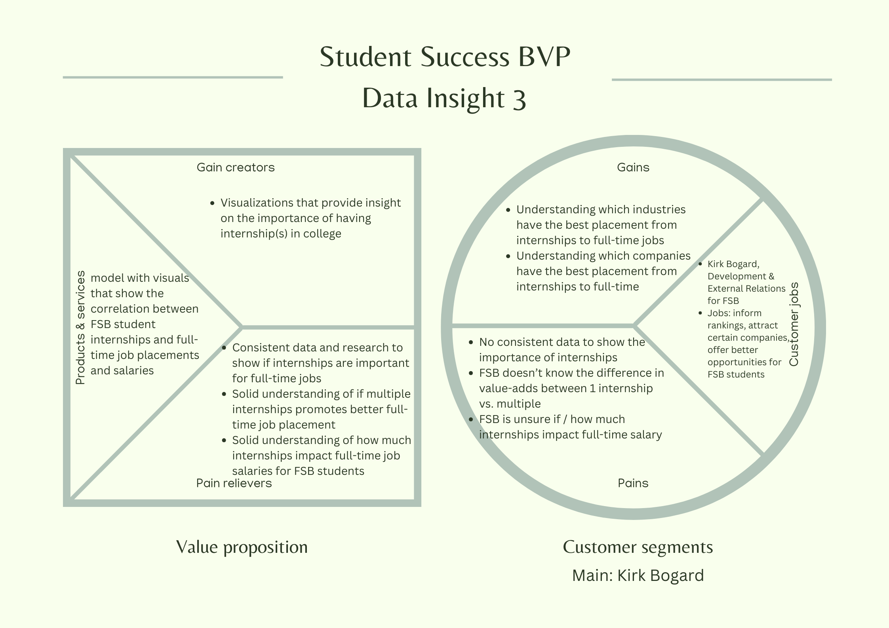

# **Description**

## Audience and Purpose

Our audience is Kirk Bogard who is the Associate Vice President for Development & External Relations at FSB. We are developing this analysis so that he is able to inform FSB Career Services of how internships impact student's ability to place in full-time positions. This analysis will be useful when FSB is attempting to attract companies who look to hire interns. FSB can also inform students of the value of internships


## Business Value Proposition



## Data Description

This dataset has three years of data representing FSB graduates from years 2019 to 2021. The dataset currently has 42 variables from a survey that FSB graduates took in those years. There is currently a lot of information in this dataset, some of which is not needed to analyze Data Insight #3, internships to full-time placement. We want to clean the dataset to make our analysis of internships to full-time placement a bit easier.


```{r setup, include=FALSE}
knitr::opts_chunk$set(echo = TRUE)
```

# **Data Cleaning**

## Inserting Data

```{r}
df <- readRDS('FSB_BI_Survey_2019_2021.rds')
```

## Cleaning the Data

**Keeping columns that are related to internships and full-time placements for the students**


```{r}
new_df <- subset(df, select = c(32:38))
new_df$survey_salary = df$survey_salary
head(new_df)
```

**Turning survey_plans column into a factored column**

```{r}
new_df$survey_plans = as.factor(new_df$survey_plans)
```

**Omitting all null values for survey_plans:**

```{r}
new_df <- new_df[!is.na(new_df$survey_plans), ]
```

**Making a column that has a "1" if the candidate has accepted a fulltime job OR they have at least 1 offer, otherwise "0":**

```{r}
new_df$fulltimejob <- ifelse((new_df$survey_offers >= 1 & !is.na(new_df$survey_offers) ) | new_df$survey_plans == "accepted fulltime job", 1, 0)
unique(new_df$fulltimejob)
```

*Rationale for the "fulltimejob" column:*

We wanted to count full-time job placement as anyone who has done one of the following: \* said that they "accepted a fulltime job" as their survey plan \* put that they got at least 1 offer in their survey

We decided to add the second criteria bullet to full-time job placements because even if someone is, for example, "continuing their education" in the future, if they got at least 1 offer, they could have had a full time job. Since we are solely looking at full-time job placements, we wanted to look at everyone who has a full-time job or could've chosen to take a full-time job if they had at least one offer.


**Making <NA>, "N/A", "RPT" in survey_internships equal to 0:**

```{r}
new_df$survey_internships[is.na(new_df$survey_internships)] = 0
new_df$survey_internships[(new_df$survey_internships) == "N/A"] = 0
new_df$survey_internships[(new_df$survey_internships) == "RPT"] = 0
unique(new_df$survey_internships)
```

## Final Data Subset

**Creating a subset of the data to get rid of the unnecessary columns:**

```{r}
final_df <- subset(new_df, select = c(survey_offers, survey_plans, survey_salary, fulltimejob, survey_internships))
head(final_df)
```

The final_df dataset is what we are going to use to run our analysis on for Data Insight #3

# **Computing Environment**
```{r}
sessionInfo()
```

